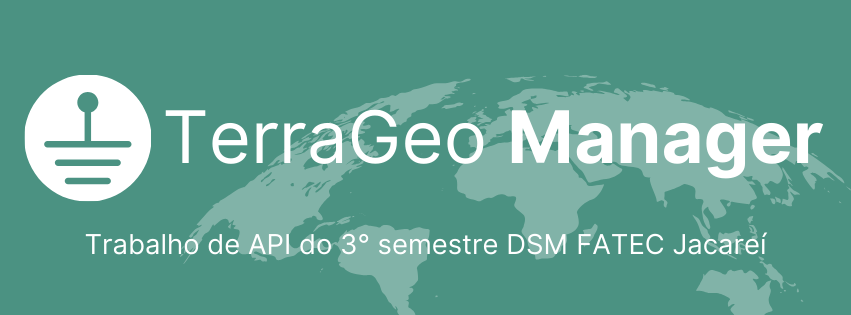

    

    

    <a href="#sobre">Sobre</a>  |  
    <a href="#backlogs">Backlogs</a>  |  
    <a href="#tecnologias">Tecnologias</a>  |  
    <a href="#equipe">Equipe</a>

    
    

    
## 📑 Sobre o projeto

O objetivo do projeto é construir um sistema web para o gestor fazer a administração dos projetos 
de mapeamento

> _Projeto baseado na metodologia ágil SCRUM, procurando desenvolver a Proatividade, Autonomia, Colaboração e Entrega de Resultados dos estudantes envolvidos_
    

<a href="">📌<strong>Documentação</strong></a>   

📌Status do Projeto: **Em andamento** 🚧

### 🏁 Entregas de Sprints
Cada entrega foi realizada a partir da criação de uma branch neste repositório com um relatório completo de tudo o que foi desenvolvido naquela sprint. Observe a relação a seguir:
| Sprint | Previsão de entrega | Status           | Histórico |
|:--:|:----------:|:-------------------|:-------------------------------------------------:|
| 01 | 04/04/2024 | ✔️ Concluída      |  [ver relatório](https://github.com/TerraGeoManager/TerraGeoManager/tree/Sprint01?tab=readme-ov-file) |
| 02 | 08/05/2024 | 🚀 Iniciado    | [ver relatório](https://github.com/TerraGeoManager/TerraGeoManager/tree/Sprint-02) | 
| 03 | -- | 🚧 Não iniciado  |  [ver relatório]() |

Repositorios do Projeto: 

| [FrontEnd](https://github.com/TerraGeoManager/frontend)  | [BackEnd](https://github.com/TerraGeoManager/backend)  |
|---------------------|------|

→ [Voltar ao topo](#topo)

## 🎯 Backlogs, Épicos & User Stories

###  Requisitos

###  Epic, User Store
 

###  Planejamento Das Sprints

→ [Voltar ao topo](#topo)
    

## 🛠️ Tecnologias

As seguintes ferramentas, linguagens, bibliotecas e tecnologias foram usadas na construção do projeto:

→ [Voltar ao topo](#topo)

 ## 👥 Equipe  
    
|    Função     | Nome                                  |                                                                                                                                                      LinkedIn & GitHub                                                                                                                                                      |
| :-----------: | :------------------------------------ | :-------------------------------------------------------------------------------------------------------------------------------------------------------------------------------------------------------------------------------------------------------------------------------------------------------------------------: |
|  Scrum Master   | Beatriz Roberto Montanini  |                        |
|  Product Owner  | Flavio Eduardo Linguanotto |             |
| Dev Team |  Igor Vinicius Santos Fonseca  |   | 
| Dev Team | Rafael Estevam De Siqueira |   | 
| Dev Team |  Franciele Maria Chesere   |   |
| Dev Team |  Otavio Lucas Abreu  |   |
| Dev Team |  Nicolas Antunes Lemos |   |
    
→ [Voltar ao topo](#topo)
